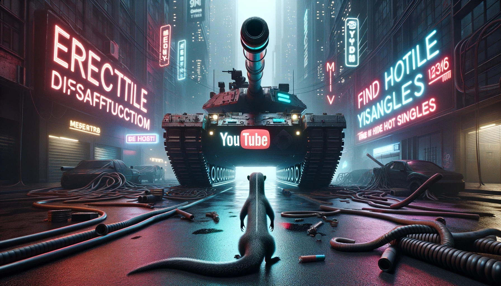

# Enshittification



Enshittification is a Python application that allows users to interact with their YouTube subscriptions, offering options to download and play the most recent videos from subscribed channels in high quality, therefore subverting YT's ongoing attempts to shittify their platform beyond repair.

## Prerequisites

- Python 3.x
- VLC media player
- ffmpeg
- YouTube Data API v3 credentials ( and you'll have to allow localhost as a uri redirect)

## Installation

1. Clone the repository:

\```shell
git clone https://github.com/alphastrata/enshittification.git
cd enshittification
\```

2. Install the required Python packages:

\```shell
poetry install
\```

3. Obtain YouTube Data API v3 credentials and save them as \`client_secret.json\` in the project directory. Follow the [official guide](https://developers.google.com/youtube/registering_an_application) to create a project, enable the YouTube Data API v3, and obtain OAuth 2.0 credentials.

## Usage

1. Run the application:

\```shell
python main.py
\```

2. The application will open a new browser window asking for permission to access your YouTube account. Grant the necessary permissions.

3. The application will fetch your YouTube subscriptions and offer options to download and play the most recent videos.

4. Choose \`yes\` to download and play a video, \`no\` to skip, or \`next\` to move to the next subscription.

## Testing

The application includes a test suite to validate the \`download_and_play\` function. Run the tests using \`pytest\`:

\```shell
pytest tests/
\```

## License

This project is licensed under the MIT License - see the [LICENSE](LICENSE) file for details.
